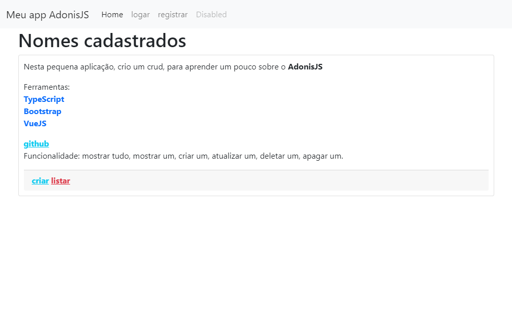

# Clube de membros - Usando AdonisJS

<!---Esses são exemplos. Veja https://shields.io para outras pessoas ou para personalizar este conjunto de escudos. Você pode querer incluir dependências, status do projeto e informações de licença aqui--->



> O projeto clube-de-membros foi feito para fins de estudo, porem, há funcionalidades que são cotidianas em um sistema convencional, há um crud de nomes.
### Ajustes e melhorias

O projeto ainda está em desenvolvimento e as próximas atualizações serão voltadas nas seguintes tarefas:

- [x] create
- [x] update
- [x] edit
- [X] delete
- [X] read

## 🚀 Instalando clube-de-membros

Para instalar o clube-de-membros, siga estas etapas:

Linux:
```
$ git clone <este projeto>
$ npm install ou yarn install
```

Windows:
```
$ git clone <este projeto>
$ npm install ou yarn install
```

## ☕ Usando clube-de-membros

Para usar clube-de-membros, siga estas etapas:

```
node ace serve --watch
```

Adicione comandos de execução e exemplos que você acha que os usuários acharão úteis. Fornece uma referência de opções para pontos de bônus!

## 🤝 Colaboradores

<table>
  <tr>
    <td align="center">
      <a href="#">
        <br>
        <sub>
          <b>JAS</b>
        </sub>
      </a>
    </td>
  </tr>
</table>

## 📝 Licença

Esse projeto está sob licença. Veja o arquivo [LICENÇA](LICENSE.md) para mais detalhes.

[⬆ Voltar ao topo](#Clube-de-membros---Usando-AdonisJS)<br>
